# airduck-icenessie

<p align="center">
  
</p>

A modern data stack proposal for handling Embeddings on data laheouses. Unlocks the value of datasets generated by Vector Search & RAG (Retrieval-Augmented Generation) use cases, combining open-source data lakehouse technologies embedding models.

## Overview

This architecture demonstrates how to build a RAG system without proprietary vector databases, featuring a **dual-lane vector search strategy**:

- **DuckDB + VSS** — Low-latency lane (<10ms) for real-time RAG chat interfaces
- **Trino + Iceberg** — Governance lane for auditable batch comparisons and compliance
- **Apache Iceberg + Nessie** — Open table format with Git-like versioning (source of truth)
- **dbt** — Medallion architecture transformations (Bronze → Silver → Gold)
- **Apache Airflow** — Orchestration for embeddings and index synchronization
- **MinIO** — S3-compatible object storage

**Key Feature:** Both search lanes produce **identical results** (verified to 6 decimal places) because embeddings are generated once in Iceberg and indexed to DuckDB.

> For detailed architecture documentation, see [ARCHITECTURE.md](./ARCHITECTURE.md)

## Architecture

```mermaid
flowchart TD
    A[👤 User Query] --> B[🖥️ Next.js Frontend<br/>Port 3000]
    B --> C[⚡ FastAPI<br/>Port 8000]
    C --> D{🔀 Dual-Lane Router}

    D --> E[🚀 /search<br/>Low-Latency Lane]
    D --> F[🔍 /search/iceberg<br/>Governance Lane]

    E --> G[🦆 DuckDB HNSW<br/>EFS Index]
    F --> H[📊 Trino<br/>Port 8085]

    H --> I[🌲 Nessie<br/>Port 19120]
    I --> J[❄️ Iceberg Tables]
    J --> K[📦 MinIO S3<br/>Port 9000]

    L[⚙️ Airflow :8080] --> M[dbt_transforms]
    L --> N[embed_iceberg_gold]
    L --> O[daily_reindex]

    M --> H
    N --> J
    O --> G
```



> See [ARCHITECTURE.md](./ARCHITECTURE.md) for detailed diagrams and scaling guide.

## Services

| Service | Port | Description |
|---------|------|-------------|
| Frontend | 3000 | Next.js search UI |
| FastAPI | 8000 | Vector search API with embedding generation |
| Airflow | 8080 | Workflow orchestrator |
| Trino | 8085 | Federated SQL query engine |
| Nessie | 19120 | Iceberg catalog with git-like versioning |
| MinIO | 9000/9001 | S3-compatible object storage |
| PostgreSQL | 5432 | Airflow metadata DB |

## Quick Start

### Prerequisites

- Docker & Docker Compose
- 8GB+ RAM recommended

### Running the Stack

```bash
# Start all services
docker compose up -d

# View logs
docker compose logs -f

# Stop all services
docker compose down
```

### Access Points

| Service | URL | Credentials |
|---------|-----|-------------|
| Frontend | http://localhost:3000 | - |
| API Docs | http://localhost:8000/docs | - |
| Airflow UI | http://localhost:8080 | `airflow` / `airflow` |
| Trino UI | http://localhost:8085 | - |
| Nessie UI | http://localhost:19120 | - |
| MinIO Console | http://localhost:9001 | `minioadmin` / `minioadmin` |

## Dual-Lane Vector Search

The system provides **two search paths** with **identical results** (verified to 6 decimal places):

| Lane | Endpoint | Latency | Use Case |
|------|----------|---------|----------|
| **Low-Latency** | `/search` | <10ms | RAG chat, autocomplete, real-time |
| **Governance** | `/search/iceberg` | ~500ms | Audits, compliance, batch reports |

> See [ARCHITECTURE.md](./ARCHITECTURE.md) for detailed comparison and lane selection guide.

### `/search` - DuckDB (Low-Latency Lane)

```bash
curl -X POST http://localhost:8000/search \
  -H "Content-Type: application/json" \
  -d '{"query": "vector databases", "top_k": 5}'
```

| Parameter | Type | Default | Description |
|-----------|------|---------|-------------|
| `query` | string | required | Search query text |
| `top_k` | int | 10 | Number of results |
| `use_vector` | bool | true | Use vector search (false = text search) |
| `use_hnsw` | bool | false | Use HNSW index for O(log n) performance |

### `/search/iceberg` - Trino (Governance Lane)

```bash
curl -X POST http://localhost:8000/search/iceberg \
  -H "Content-Type: application/json" \
  -d '{"query": "vector databases", "top_k": 5}'
```

**Benefits:**
- Queries the data lakehouse directly (source of truth)
- Time-travel queries for reproducible audits
- Scales with Trino workers
- Full SQL flexibility for complex analytics

### Embedding Consistency (Single Source of Truth)

```
embed_iceberg_gold DAG → Iceberg Gold (S3) → daily_reindex DAG → DuckDB (EFS)
     (generate once)      (source of truth)      (copy verbatim)    (replica)
```

Embeddings are generated **once** in Iceberg via `embed_iceberg_gold`, then **copied** to DuckDB via `daily_reindex`. This guarantees identical search results across both lanes.

### Search Performance Comparison

| Endpoint | Method | Complexity | Best For |
|----------|--------|------------|----------|
| `/search` (default) | Brute force | O(n) | Real-time docs, <100k vectors |
| `/search?use_hnsw=true` | HNSW index | O(log n) | Large datasets, batch-indexed |
| `/search/iceberg` | Trino SQL | O(n) | Audit trail, complex queries |

## API Endpoints

### Vector Search (FastAPI)

| Method | Endpoint | Description |
|--------|----------|-------------|
| GET | `/health` | Health check |
| GET | `/status` | DuckDB index status |
| GET | `/iceberg/status` | Iceberg embedding coverage |
| POST | `/search` | DuckDB vector search (brute force or HNSW) |
| POST | `/search/iceberg` | Trino/Iceberg vector search |
| POST | `/search/s3` | Search directly on S3 parquet files |
| POST | `/index` | Index single document (auto-embeds) |
| POST | `/index/batch` | Batch index documents |
| POST | `/embed` | Generate embedding for text |
| DELETE | `/documents/{id}` | Delete document |
| DELETE | `/documents` | Clear all documents |

## Embedding Model

The system uses **`all-MiniLM-L6-v2`** for semantic embeddings:

| Metric | Value |
|--------|-------|
| Dimensions | 384 |
| Model size | ~22 MB |
| Container memory | ~370 MB |
| Inference | CPU-only (no GPU required) |

Embeddings are generated automatically when indexing documents via the API.

## Airflow DAGs

| DAG | Purpose | Schedule |
|-----|---------|----------|
| `dbt_seed_bronze_data` | Create Bronze table with sample data | Manual |
| `dbt_manual_transforms` | Run dbt Bronze → Silver → Gold + compaction | Daily 1 AM |
| `embed_iceberg_gold` | Generate embeddings for Gold layer (source of truth) | Manual |
| `daily_reindex` | Copy embeddings from Iceberg to DuckDB HNSW index | Daily 2 AM |
| `iceberg_maintenance` | Full table optimization (compaction, cleanup) | Daily 3 AM |

### Small Files Problem

The `iceberg_maintenance` DAG addresses the **small files problem** common in data lakes:

| Task | Purpose |
|------|---------|
| `compact_small_files` | Merge small files into 128MB target size |
| `expire_old_snapshots` | Remove snapshots older than 7 days |
| `remove_orphan_files` | Clean up unreferenced data files |

Compaction also runs automatically after dbt transforms and embedding generation.

## Data Pipeline

The system uses a **medallion architecture** (Bronze → Silver → Gold) with Iceberg as the single source of truth. Embeddings are generated once in Iceberg via `embed_iceberg_gold` and copied to DuckDB via `daily_reindex`.

| Layer | Purpose | Transformations |
|-------|---------|-----------------|
| Bronze | Raw ingestion | None |
| Silver | Cleaned data | Deduplication, SHA256 hashing |
| Gold | Search-ready | Chunking, scoring, 384-dim embeddings |

dbt transformations run on Trino, with Iceberg tables stored in MinIO.

## Project Structure

```
airduck-icenessie/
├── docker-compose.yml       # Service orchestration
├── ARCHITECTURE.md          # Detailed architecture docs
├── app/                     # FastAPI + DuckDB vector search
│   ├── main.py             # API endpoints + embedding
│   └── requirements.txt    # CPU-only PyTorch
├── airflow/                 # Workflow orchestrator
│   ├── dags/               # DAG definitions
│   │   ├── reindex_dag.py          # HNSW index builder
│   │   ├── embed_iceberg_dag.py    # Iceberg embeddings
│   │   └── dbt_transform_dag.py    # dbt transforms
│   └── dbt/                # dbt project
│       ├── models/
│       │   ├── bronze/     # Raw layer
│       │   ├── silver/     # Cleaned layer
│       │   └── gold/       # Enriched layer
│       └── profiles.yml    # Trino connection
├── frontend/                # Next.js UI
│   └── src/app/
├── trino/                   # Trino configuration
│   ├── catalog/            # Iceberg + Nessie config
│   └── etc/                # Server config
└── minio-data/              # Persistent S3 storage
```

## Development

### Local Development (without Docker)

#### FastAPI

```bash
cd app
python -m venv venv
source venv/bin/activate
pip install -r requirements.txt
uvicorn main:app --reload
```

#### Frontend

```bash
cd frontend
npm install
npm run dev
```

## Configuration

Key environment variables:

| Variable | Description | Default |
|----------|-------------|---------|
| `EMBEDDING_MODEL` | Sentence transformer model | `all-MiniLM-L6-v2` |
| `S3_ENDPOINT` | MinIO/S3 endpoint | `http://minio:9000` |
| `EFS_PATH` | Shared storage path | `/mnt/efs` |
| `TRINO_HOST` | Trino server host | `trino` |
| `NEXT_PUBLIC_API_URL` | API URL for frontend | `http://localhost:8000` |

## Data Persistence

| Data | Storage | Survives Restart? |
|------|---------|-------------------|
| DuckDB index | Docker volume (`airduck_efs`) | ✅ Yes |
| MinIO/S3 data | Bind mount (`./minio-data/`) | ✅ Yes |
| Iceberg tables | MinIO S3 | ✅ Yes |
| Airflow metadata | Docker volume (`airduck_postgres`) | ✅ Yes |
| Nessie catalog | In-memory (default) | ❌ Rebuilt on restart |

The `iceberg-init` container automatically recreates Iceberg schemas on startup.

## Further Reading

- [ARCHITECTURE.md](./ARCHITECTURE.md) - Detailed architecture and scaling guide
- [DuckDB VSS Extension](https://duckdb.org/docs/extensions/vss)
- [Apache Iceberg](https://iceberg.apache.org/)
- [Project Nessie](https://projectnessie.org/)
- [dbt-trino](https://github.com/starburstdata/dbt-trino)

## License

MIT

---

*Last updated: 2026-01-28*  
*Dual-lane consistency verified with identical scores to 6 decimal places*
